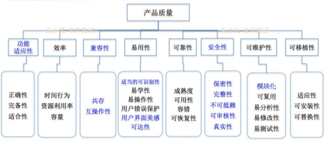
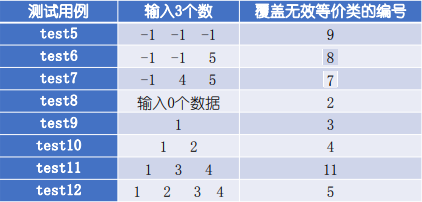
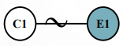
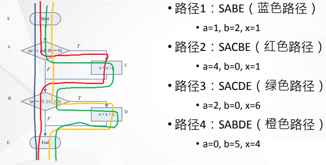
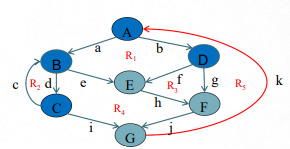

# 前言

1. 写的比较匆忙，重点也不明确，没什么参考价值
2. 致谢：ly，zxq
3. 重点来源：信安
4. ※：补充内容
5. ★：重点
6. ✦：个人推测考点
7. 考试范围：1-9章
8. [获取最新版本](https://github.com/3210448723/SoftwareTestCourse)

# 题型

1. 判断：10
2. 简答：40
3. 应用：36
4. 综合：14

# 重点

## 软件缺陷★

### 定义✦

软件缺陷是指计算机或系统存在的任何一种**破坏正常运行能力**的问题，错误或隐藏的功能缺陷，瑕疵，其结果会导致软件产品在某种程度上**不能满足用户需求**。

* 从产品内部看，软件缺陷是软件产品**开发**或**维护**过程中所存在的**错误**、**毛病**等各种问题；
* 从外部看，软件缺陷是系统所需要实现的某种**功能的失效或违背**。

### 来源

1. 技术问题

   算法错误，语法错误，计算和精度问题，接口参数传递不匹配

2. 团队工作

   沟通不充分，误解

3. 软件本身

   * 文档错误
   * 用户使用场合(user scenario)
   * 时间上不协调、或不一致性所带来的问题
   * 系统的自我恢复或数据的异地备份、灾难性恢复等问题

### 严重级别

* 微小的（Minor）。一些小问题如有个别错别字、文字排版不整齐等， 对功能几乎没有影响，软件产品仍可使用。
* 一般的（Major）。不太严重的错误，如次要功能模块丧失、提示信息 不够准确、用户界面差和操作时间长等。
* 严重的（Critical）。严重错误，指功能模块或特性没有实现，主要功能 部分丧失，次要功能全部丧失，或致命的错误声明。
* 致命的（Fatal）。致命的错误，造成系统崩溃、死机，或造成数据丢失、 主要功能完全丧失等。

### 处理流程※

## 软件测试

### 原因

* 没有测试，软件就没有**质量**；
* 测试没有做好，软件问题就可能引发**灾难**或者软件企业带来巨大的**损失**。
* 软件测试是**质量保证**的重要手段之一，是软件开发过程**不可缺少**的部分。

### 定义✦

* 从一个通常是**无限的执行域**（集合）中选择**合适的**、**有限的**的测试用例，对程序所**期望的行为进行动态验证**的活动过程。
* 在**特定的条件**下运行系统或构件，观察或记录结果，对系统的某个方面做出**评价**
* 分析某个软件项以发现现存的和要求的条件之**差别**（即错误）并评价此软件项的特性
* 软件测试是由“验证（Verification）”和“有效性确认（Validation）”活动构成的整体（IEEE1012）
  * “验证”是检验软件是否已正确地实现了产品规格书所定义的系统**功能和特性**
  * “有效性确认”是确认所开发的软件是否满足用户真正**需求**的活动。

### [目的✦](https://www.baidu.com/link?url=Ae1Y5JFxoMkwt8wL57eE-pKWTyzqXtMU-_JdyfTRK6yU1wRUt0wNqZd4yrn3JCd1&wd=&eqid=bbe401a10000e77c00000006645f39c9)

1. 提高软件的质量；
2. 保证软件的安全；
3. 降低软件开发成本；
4. 降低企业风险；
5. 提升用户体验感。

### 流程✦

1. 分析测试**需求**
2. 制定测试**计划**
3. 设计测试**用例**
4. **执行**测试
5. 编写测试**报告**

### 分类※

#### [按照测试层次分类](#V模型✦)

* 底层测试

  单元测试，验证**软件单元**（组件/模块/类/函数）是否符合软件需求与设计，开发人员自测。

* 接口层次

  集成测试，将已经测试过的软件单元组合在一起测试它们**之间的接口**，用于验证软件是否满足设计需求。

* 系统层次

  系统测试，将经过测试的软件在**实际环境中**运行，并与其他系统的成分（如数据库、硬件和操作人员等）**组合**在一起进行测试。

* 用户/业务层次

  验收测试，主要是对**软件产品说明**进行验证，逐行逐字的按照说明书的描述对软件产品进行测试，确保其符合客户的各项要求。

#### 按照测试技术分类

* ★黑盒测试：**基于需求**的测试方法，把软件（程序）当作一个**有输入与输出的黑匣子**，它把程序当作一个输入域到输出域的映射，只要输入的数据能**输出预期的结果**即可，不必关心程序内部是怎么样实现的。
  * 等价类划分法
  * 边界值分析法
  * 判定表方法
  * 因果图法
  * Pairwise方法
  * 正交试验法
  * 功能图法

* ★白盒测试：**结构化**测试方法，测试人员了解软件程序的**逻辑结构、路径与运行过程**，在测试时，按照程序的执行路径得出结果。白盒测试就是把软件 （程序）当作一个透明的盒子， 测试人员清楚的知道从输入到输出的**每一步过程**。
  * 语句覆盖
  * 判定覆盖
  * 条件覆盖
  * 判定条件覆盖
  * 条件组合覆盖
  * 基本路径覆盖

#### 按照软件质量特性分类

* 功能测试：测试软件的功能是否满足客户的需求，包括准确性、易用性、 适合性、互操作性等。
* 性能测试：测试软件的性能是否满足客户的需求，性能测试包括负载测试、压力测试、兼容性测试、可移植性测试和健壮性测试等。

#### 按照自动化程度分类

* 手工测试：测试人员一条一条的执行代码完成测试工作。费时费力且很验证保证测试效果。
* 自动化测试：借助脚本、自动化测试工具等完成相应的测试工作，它也需要人工的参与，但是它可以将要执行的测试代码或流程写成脚本，执行脚本完成整个测试工作。

#### 按照测试项目分类

* 界面类测试：验证软件界面是否符合客户需求。
* 安全性测试：试软件在没有授权的内部或外部用户的攻击或恶意破坏时如何进行处理，是否能保证软件与数据的安全。
* 文档测试：以需求分析、软件设计、用户手册、安装手册为主，主要验证文档说明与实际软件之间是否存在差异。

#### 按照测试时程序是否运行分类★

* 静态测试

  包括对软件产品的需求和设计规格说明书的评审、对程序代码的审查和静态分析等

* 动态测试

  * 通过真正运行程序发现错误，通过观察代码运行过程，获取系统行为、变量实时结果、内存、堆栈、线程和调试覆盖度等各方面的信息，以判断系统是否存在问题
  * 通过有效的测试用例和对应的输入/输出关系来分析被测程序的运行情况，以发现缺陷

#### 按测试目的/测试类型分类

1. 功能测试（ Functionality Testing )，也称正确性测试（ Correctness Testing )，验证每个功能是否按照事先定义的要求那样正常工作。

2. 性能测试（ Performance Testing )：评测与分析系统在不同负载（如并发用户、连接数、请求数据量等）条件下的系统运行情况、性能指标等。

   ★压力测试（ Stress Testing ）也可以算性能测试，侧重在**高负载**、极限负载下的系统运行情况，以发现系统不稳定、系统性能瓶颈、内存泄漏、 CPU 使用率过高等问题。

3. 安全性测试（ Security Testing )：测试系统在应对非授权的内部／外部访问、故意损坏时的系统防护能力。

4. 兼容性测试（ Compatibility Testing )：测试在系统不同运行环境（如网络、硬件、第三方软件等）环境下的实际表现，也包括共存、互操作的验证。

5. 可靠性测试（ Reliability Testing )：检验系统是否能保持长期稳定、正常地运行，如确定正常运行时间，即平均失效时间（ Mean Time Between Failures , MTBF )。可靠性测试包括强壮性测试（ Robustness Testing ）和异常处理测试（ Exception Handling Testing )。

   可恢复性测试（ Recovery Testing ）也可以归为可靠性测试，侧重在系统崩溃、硬件故障或其他灾难发生之后，重新恢复系统和数据的能力测试。

6. 易用性测试（ Usability Testing )：也称为用户体验测试，检查软件是否容易理解、使用方便和流畅、界面美观、交互友好等。

7. 回归测试（ Regression Testing ）：为保证软件中新的变化（如新增加的代码、代码修改等）不会对原有功能的正常使用有影响而进行的测试。也就是说，满足用户需求的原有功能不应该因为代码变化而出现任何新的问题。

#### 其他分类

* α测试★：软件**上线之前**进行的版本测试。由**开发人员和测试人员**或者用户协助进行测试。测试人员记录使用过程中出现的错误与问题，整个测试过程是**可控**的。
* β测试★：软件**上线之后**进行的版本测试。由**用户**在使用过程中发现错误与问题并进行记录，然后反馈给开发人员进行修复。
* γ测试★：伽马测试是**终级测试**。测试之后，该软件几乎就是上市的最终版本了。此时，不再进行软件的功能开发或改进。在这一阶段唯一可能修改的是限定范围内的代码错误。
* 随机测试：没有测试用例、检查列表、脚本或指令的测试，它主要是根据测试人员的经验对软件进行功能和性能抽查。

### 测试和质量保证的关系

#### 软件质量保证

软件质量保证（Software Quality Assurance，SQA）活动是通过对软件产品有计划的进行评审和审计来验证软件是否合乎标准的系统工程，通过协调、审查和跟踪以获取有用信息，形成分析结果以指导软件过程。

#### 关系

* SQA指导、监督软件测试的计划和执行，督促测试工作 的结果客观、准确和有效，并协助测试流程的改进。
* 软件测试是SQA重要手段之一，为SQA提供所需的数据， 作为质量评价的客观依据。
* SQA是一项管理工作，侧重于对流程的评审和监控
* 测试是一项技术性的工作，侧重对产品进行评估和验证

### 软件质量

#### 定义

软件质量是指软件产品满足基本需求及隐式需求的程度。

软件产品满足基本需求是指其能满足软件开发时所规定需求的特性，其次是软件产品满足隐式需求的程度。

#### 与缺陷之间的关系

缺陷越多，质量越差，这是对立关系；发现缺陷，及时修复，提高质量，这是统一关系。

#### 产品质量特性

### 方法

#### 基于输入域的方法

##### 等价类划分法

###### 等价类

* 某个输入域的一个特定子集合中各个输入数据对于揭露程序中的错误都是**等效**的
* 若用这个等价类中的代表值作为测试样例未发现程序错误，那么该类中其它的测试数据也不会发现程序的错误
* 测试某等价类的**代表值等效**于对这一类**其他值**的测试

###### 有效等价类

有效等价类就是**有效值**的集合，它们是**符合**程序要求、**合理且有意义**的输入数据。

###### 无效等价类

无效等价类就是**无效值**的集合，它们是不符合程序要求、不合理或无意义的输入数据。

###### 划分原则

1. 如果程序要求输入值是一个有限区间的值，则可以将输入数据划分为一个有效等价类和两个无效等价类，有效等价类为指定的取值区间，两个无效等价类分别为有限区间两边的值。
2. 如果程序要求输入的值是一个“必须成立”的情况，则可以将输入数据划分为一个有效等价类和一个无效等价类。
3. 如果程序要求输入数据是一组可能的值，或者要求输入值必须符合某个条件，则可以将输入数据划分一个有效等 价类和一个无效等价类。
4. 如果在某一个等价类中， 每个输入数据在程序中的处理方 式都不相同，则应将该等价类划 分成更小的等价类，并建立等价表。

######  划分方法

| 输入数据类型         | 划分等价类规则                                   | 划分等价类规则                   |
| -------------------- | ------------------------------------------------ | -------------------------------- |
| 布尔值               | 1个有效等价类:TRUE                               | 1个无效等价类:FALSE              |
| 连续取值范围         | 1个有效等价类:正确取值范围                       | 2个无效等价类:大于和小于取值范围 |
| 数据个数             | 1个有效等价类:正确数据个数                       | 2个无效等价类:大于和小于数据个数 |
| 集合                 | 1个有效等价类:正确的集合取值                     | 1个或多个无效等价类              |
| 需分别处理的输入数据 | 多个有效等价类:每个输入数据为1个等价类           | 1个无效等价类                    |
| 符合某些规则的输入   | 多个有效等价类:符合某个规则的输入数据为1个等价类 | 若干个无效等价类                 |

1. 区间

   如果某个输入条件指定了一个连续的有效取值范围，则可以定义一个有效等价 类和两个无效等价类

2. 数据个数

   如果某个输入条件指定了输入的数据个数约束，则可以定义一个有效等价类和两个无效等价类

3. 数据长度

4. 数据类型

###### 例题

三角形问题的等价类划分✦

输入3个正数a、b、 c作为三角形的三条边，判断这3个数构成的是一般三角形、等边三角形、 等腰三角形，还是无法构成三角形。

1. 等价类表

   

2. 测试用例表

   1. 覆盖有效等价类

      

   2. 覆盖无效等价类

      

余额宝提现的等价类划分

快速到账可以累积分次提取：快速到 账的日提现金额为10000，表明在一 天之内，只要提现金额没有累积到 10000，则可多次提取，据此，可以 将快速到账细分为第1次提现和第n次 提现，第n次提现的最大金额为 10000减去已经提现的金额。

1. 等价类表

   

2. 测试用例表

   1. 覆盖有效等价类

      

   2. 覆盖无效等价类

      

##### 边界值分析法

###### 定义

在**边界附近**寻找某些点作为测试数据，而不是在等价类内部选择测试数据。

###### 选择测试数据

技巧※

上点：边界上的点(绿色)

离点：离边界最近的点（黄色)

内点：范围内的点（蓝)

1. 上点：必选(不考虑区间开闭)
2. 内点：必选(建议选择中间范围)
3. 离点：开内闭外(考虑开闭区间，开区间选择内部离点，闭区间选择外部离点)

###### 例题

1. 三角形问题

   输入3个正数a、b、 c作为三角形的三条边，判断这3个数构成的是一般三角形、等边三角形、 等腰三角形，还是无法构成三角形。

   如果要求三角形的边长取值范围为 1~100，则可以使用边界值分析法对 三角形边界边长进行测试，在设计测试用例时，分别选取1、2、50、99、 100五个值作为测试数据。

   测试用例：

   

2. 余额宝提现

   快速到账可以累积分次提取：快速到 账的日提现金额为10000，表明在一 天之内，只要提现金额没有累积到 10000，则可多次提取，据此，可以 将快速到账细分为第1次提现和第n次 提现，第n次提现的最大金额为 10000 减去已经提现的金额。

   假设余额宝中余额为50000

   1. 如果是第一次快速到账提现，则分别对0和10000两个边界值进行测试， 分别取值-1、0、1、5000、9999、 10000、10001七个值作为测试数据。
   2. 如果是第n次提现（假设已提现2000），则分别对0和8000 两个边界值进行测试，分别取值-1、0、1、5000、7999、 8000、8001七个值作为测试数据。
   3. 对于普通到账提现，则对0和50000两个边界值进行测试，分 别取-1、0、1、20000、49999、50000、50001七个值作为 测试数据。

   测试样例

   

   

   

#### 基于组合技术和组合优化的测试方法

##### 基于判定表的测试法

###### 决策表/判定表

实质是一种逻辑表。 它可以把复杂的逻辑关系和多种条件组合的情况表达的既具体又明确，利用决策表可以设计出完整的测试用例集合。

###### 决策表组成

1. 条件桩：列出问题的**所有条件**，除了某些问题对条件的先后次序有要求之外，通常决策表中所列条件的先后次序都无关紧要。
2. 条件项：条件项就是条件桩的所有可能**取值**。
3. 动作桩：动作桩就是问题所有可能采取的**操作**，这些操作一般没有先后次序之分。
4. 动作项：指出在条件项的各组取值情况下应**采取的动作**。

###### 无关条件项

不影响结果取值的原因称为无关条件项，用“-” 表示。忽略无关条件项，可以将多条规则合并。

###### 例题

1. 三角形问题✦

   1. 题干

      输入3个正数a、b、 c作为三角形的三条边，判断这3个数构成的是一般三角形、等边三角形、 等腰三角形，还是无法构成三角形。

   2. 原因

      1. c~1~：是否构成三角形
      2. c~2~：a=b?
      3. c~3~：b=c?
      4. c~4~：c=a?

   3. 结果

      1. e~1~：不构成三角形
      2. e~2~：一般三角形
      3. e~3~：等腰三角形
      4. e~4~：等边三角形
      5. e~5~：不符合逻辑（如果有两对边相等，但一对边不相等）

   4. 决策表

      

   5. 化简后的决策表

      

   6. 测试样例

      

2. 工资发放决策表

   1. 题干

      某公司的薪资管理制度如下：员工工资分为年薪制与月薪制两种，员工的错误定位包括普通错误与严重错误两种，如果是年薪制的员工，犯普 通错误扣款2%，犯严重错误扣款4%；如果是月薪制的员工，犯普通错 误扣款4%，犯严重错误扣款8%。该公司编写了一款软件用于员工工资 计算发放，现在要对该软件进行测试。

   2. 原因和结果

      

   3. 决策表

      

   4. 测试用例

      

##### 基于因果图的测试法

###### 定义

因果图使用一些简单的逻辑符号和直 线将程序的因（输入）与果（输出） 连接起来，一般原因用ci表示，结果 用ei表示，ci与ei可以取值“0”或 “1”，其中“0”表示状态不出现， “1”表示状态出现。

###### 原因与结果之间的关系

恒等（等价）关系

若原因出现，则结果出现；若原因不出现，则结果也不出现。

非关系

若原因出现，则结果不出现；若原因不出现，则结果出现。

或关系

若几个原因中有1个出现，则结果出现；若原因都不出现，则结果不出现。

与关系

若几个原因都出现，结果才出现。 若其中有1个原因不出现，则结果不出现。

###### 原因与原因之间的关系

互斥 （E）

表示C1、C2两个原因不会同时成立，两个中最多有一个可能成立。

包含 （I）

表示C1、C2、C3这3个原因中至少有一个必须成立。

唯一 （O）

表示C1和C2当中必须有一个，且仅有一个成立。

要求 （R）

表示当C1出现时，C2必须也出现。C1出现时不可能C2不出现

###### 结果与结果之间的关系

屏蔽 （M）

表示当E1是1时，E2必须是0。而当E1为0时，E2的值不定。

###### 例题

1. 来源：PPT和实验三

   1. 题干

      当输入第一个字符是‘#’ 或者是‘\*’ ，第二个输入字符是数字时，文档将被修改；如果第一个输入字符不是‘#’ 或 ‘\*’ ，则输出消息N，如果第二个输入字符不是数字，则输出消息M。

   2. 原因和结果

      | 编号 | 原因             | 编号 | 结果       |
      | ---- | ---------------- | ---- | ---------- |
      | C1   | 第一个输入是‘*’  | R1   | 修改文件   |
      | C2   | 第一个输入是‘#’  | R2   | 输出消息 N |
      | C3   | 第二个输入是数字 | R3   | 输出消息 M |

   3. 因果图

      

   4. 决策表

      |      |      | 1    | 2    | 3    | 4    | 5    | 6    |
      | ---- | ---- | ---- | ---- | ---- | ---- | ---- | ---- |
      | 条件 | C1   | T    | F    | F    | T    | F    | F    |
      |      | C2   | F    | T    | F    | F    | T    | F    |
      |      | C3   | T    | T    | T    | F    | F    | F    |
      | 结果 | R1   | √    | √    |      |      |      |      |
      |      | R2   |      |      | √    |      |      | √    |
      |      | R3   |      |      |      | √    | √    | √    |

   5. 测试用例

      | 测试用例编号 | 决策表规则编号 | 测试用例 | 预期执行结果 |
      | ------------ | -------------- | -------- | ------------ |
      | 1            | 1              | \*1      | 修改文件     |
      | 2            | 2              | #2       | 修改文件     |
      | 3            | 3              | a3       | N            |
      | 4            | 4              | \*b      | M            |
      | 5            | 5              | #c       | M            |
      | 6            | 6              | de       | N和M         |

2. 来源：课本P52

   实质上跟上面一样，只是换了种说法，但是书上的答案好像有点问题

##### [Pairwise 方法](https://blog.csdn.net/aassddff261/article/details/42776543)

###### 定义

PairWise（又称全对偶）策略是组合测试中的一种设计测试用例的方法，可以有效地、合理地减少输入条件的组合数

###### IPO基本步骤

1. 选择2个因素，生成一组测试用例集，包含2个因素的所有取值组合；
2. 在水平方向上扩展，即加入另一个因素，并从中选择一个新的取值，保证覆盖最多的因素成对取值组合；
3. 如果水平扩展仍然存在没有被覆盖的成对组合，则在垂直方向上扩展，生成新的测试用例

##### 正交实验法

从大量的（实验）数据（测试例）中挑选适量的、有代表 性的点（条件组合），从而合理地安排实验（测试）的一 种科学实验设计方法

#### 基于逻辑覆盖的测试方法

> 前面的是黑盒测试，这里是白盒测试

##### 语句覆盖

设计**尽可能少**的测试用例，使得被测模块中**每一条语句**都至少执行一次。

##### 判定覆盖

判定覆盖(Decision Coverage)又称为分支覆盖，其原则是在测试过程中保证**每个判定**至少有一次为真值，有一次为假值

##### 条件覆盖

###### 定义

条件覆盖(Condition Coverage)指的是使判定语句中的**每个逻辑条件**取真值与取假值至少出现一 次。

###### 测试样例

* ((a>1)&&(b\=\=0))判定表达式1
  * 条件c1：(a>1)
  * 条件c2：(b\=\=0)
* ((a\=\=2)||(x>1))判定表达式2
  * 条件c3：(a\=\=2)
  * 条件c4：(x>0)

##### 判定/条件覆盖

###### 定义

* 设计尽可能少的测试用例，使得每个判定表达式为真和为假的**路径**都能被执行到，还要求所有**条件**都取得为真和为假的可能。
* 要求设计测试用例，同时满足判定覆盖、条件覆盖要求。

###### 技巧

把复合判定表达式降维处理，使得每个流程图中每个判定节点中只包含一个条件。

###### 测试样例

* 测试数据1，要求(a>1)、(b\=\=0)、 (a\=\=2)和(x>1)同时满足，为此选择测试数据为a=2, b=0, x=5

* 测试数据2，要求(a≦ 1)、**(b≠0)**、(a≠2)  和**(x≦ 1)**同时满足，为此选择测试数 据为a=1, b=1, x=1

  > 注意每一个条件的否定都要出现过

##### 条件组合覆盖

###### 定义

设计尽可能少的测试用例，使得每个**判定表达式中**条件的所有可能**组合**都能被覆盖到。

###### 测试样例

1. 方案一

   

2. 方案二

   

##### 路径覆盖

###### 定义

设计尽可能少的测试用例，使得被测软件模块中**所有可能的执行路径**都至少被执行一次。

###### 测试样例

#### 独立路径测试

##### 步骤

1. 根据设计或代码导出程序流程图的拓扑结构-控制流图G；

2. 计算流图G的圈（环路）复杂度 V(G)；

   > 强连通图的圈 复杂度V（Ｇ）即图中独立路径的数量。

3. 确定只包含独立路径的基本路径集；

4. 设计测试用例使得集合中每一条独立路径均被执行一次。

##### 圈复杂度计算方法

1. V（G）=e-n+2

   G为一个有向强连通图，e为图G中的边数，n为图G中的结点数。

2. 判定节点数+1

   判定节点：出度为2的节点

3. V(G)=R

   R代表平面被控制流图分割成的区域数

##### 例题

三角形逻辑覆盖问题

1. 流程图

   

2. 流图

   

3. 测试用例

   判定覆盖，使程序中每个判定语句至少有一次“真”值，至少有一 次“假”值

   

## 软件测试过程模型

### [V模型✦](#按照测试层次分类)

#### 优点

将复杂的测试工作分成了**目标明确**的小阶段完成，具有**阶段性**、**顺序性**和**依赖性**，它既包含了对于源代码的底层测试也包含了对于软件需求的高层测试。

#### 缺点

只能在**编码之后**才能开始测试，早期的需求分析等前期工作没有涵盖其中，因此它不能发现需求分析等**早期**的错误，这为后期的系统测试、验收测试埋下了隐患。

### W模型

#### 优点

测试范围不仅包括程序，还包括需求分析、软件设计等前期工作，这样有利于**尽早**全面的发现问题。 

#### 缺点

它将软件开发过程分成需求、设计、编码、集成等一系列的**串行**活动，无法支持迭代、自发性等需要变更调整的项目。

### 敏捷测试过程模型✦

## 单元测试

### 定义

对软件模块的正确性进行分析和检验，测试软件模型的功能、接口、数据结构、算法、错误处理等方面是否存在问题。

### 内容

* 模块接口测试
* 局部数据结构测试
* 路径测试
* 错误处理测试
* 边界测试

### 辅助模块

#### 驱动模块(Driver)

相当于被测模块的主程序。它接收测试数据，把这些数据传送给被测模块，最后输出实测结果。

#### 桩模块(Stub)

用以代替被测模块调用的子模块。桩模块可以做少量的数据操作，不需要把子模块所有功能都带进来，但不允许什么事情也不做。

### JUnit

#### 定义

Junit是一个开放源代码的Java测试框架（单元测试框架体系xUnit的一个实例），用在编写和运行可重复的的测试上

#### 特性

* 提供了编写测试类的框架，使测试代码的编写更方便 
* 共享测试数据的测试工具
* 方便地组织和运行测试的测试套件
* 可以使测试代码与产品代码分开，这更有利于代码的 打包发布和测试代码的管理
* 易于集成到程序构建过程中，JUnit和Ant的结合还可以实施增量开发。
* 具有很强的扩展性

## 集成测试✦

### 定义

* 将已经测试过的软件单元组合在一起测试它们**之间的接口**，用于验证软件是否满足设计需求。

* 在单元测试的基础上，需要将所有模块按照设计要求组装成为系统。这时需要考虑： 

  * 穿越模块接口的数据是否会丢失；

  * 一个模块的功能是否会对另一个模块的功能产生不利的影响；

  * 各个子功能组合起来，能否达到预期的父功能；

  * 全局数据结构是否有问题；

  * 单个模块的误差累积起来，是否会放大，从而达到不能接受的程度。

  * 单个模块的错误是否会导致数据库错误。

### 策略

* 一次性集成方式
* 增殖式集成方式
  * 自顶向下增殖方式
  * 自底向上增殖方式
  * 混合增值方式

## 系统测试

### 定义

软件集成测试完成后、得到完整的软件系统时，由测试人员或质量保证人员对软件进行分析和验证，来确保质量需求（功能、 性能、压力、负载、容错性、兼容性、安全性、可靠性，等等） 的满足情况。

### 功能测试✦

#### 定义

依据产品设计规格说明书完成对产品功能进行操作，以验证系统是否满足用户的功能性需求。

#### 步骤

#### 功能测试自动化✦

##### 基于接口的功能测试

测试工具

* Postman
* Jmeter
* REST Assured
* Karate

##### Web客户端的UI自动化测试

###### 方法

* 重点测试功能逻辑，按功能、子功能、功能点等层次展开测试
* 基于输入域和组合测试等方法（见第3章）进行输入的设计，驱动测试，并观察输出
* 扮演用户角色，从应用场景来遍历用户使用产品的主要操作路径
* 针对不同设置进行测试
* 用户界面测试

###### 测试工具

* Selenium
* Cypress

### 回归测试★

#### 定义✦

对修改后的程序重新进行测试确认原有的缺陷已经消除并且没有引入新的缺陷，这个重新测试的过程就叫作回归测试。

#### 原因

一旦程序某些区域被修改了，就可能影响原来正常工作的区域，导致受影响的区域出现回归缺陷。

#### 回归缺陷

原来正常工作的功能，没有发生需求变化，而由于受其它改动影响而产生的问题。

#### 目的

为了**发现回归缺陷**而进行的测试。如果没有回归测试，产品就带着回归缺陷被发布出去了，造成严重后果。

#### 策略✦

1. 再测试全部用例
2. 基于风险选择测试
3. 基于操作剖面选择测试
4. 再测试修改的部分

## 专项测试

### 性能测试

#### 定义

发现系统性能问题或获取系统性能相关指标，如响应时间、吞吐量、并发用户数、TPS、点击率、资源利用率等。

#### 分类

1. 负载测试
2. 压力测试
3. 并发测试
4. 配置测试
5. 可靠性测试
6. 容量测试。

#### 流程

#### 常用工具

LoadRunner是一款适用于各种体系架 构的性能测试工具，它能预测系统行为并优化系统性能，其工作原理是通过模 拟一个多用户（虚拟用户）并行工作的 环境来对应用程序进行负载测试

Jmeter是由Apache开发维护一款开源免费的 性能测试工具，Jmeter以Java作为底层支撑 环境，它最初是为测试Web应用程序而设计 的，但后来随着发展逐步扩展到了其他领域。 现在Jmeter可用于静态资源和动态资源的测 试，例如，它可用于模拟服务器、服务器组、 网络或对象上的重负载以测试其强度、分析不同负载类型下的整体性能。

### 安全性测试

#### 定义

软件安全性测试就是检验系统权限设置有效性、防范非法入侵的能力、数据备份和恢复能力等，设法找出上述各种安全性漏洞。

#### 准则

使非法侵入的代价超过被保护信息的价值，此时非法侵入者已无利可图。

#### 测试方法

1. 静态的代码分析方法
2. 动态的渗透测试
3. 应用程序的安全测试
4. API安全测试
5. 配置扫描
6. 安全审计

#### 常用工具

1. Web 漏洞扫描工具——AppScan
2. 端口扫描工具——Nmap
3. 抓包工具——Fiddler
4. Web 渗透测试工具——Metasploit

### 兼容性测试

兼容性测试是在特定的或不同的硬件、网络环境和操作系统平台上、不同的 应用软件之间，验证软件系统能否正常地运行，以及能否正确存取原先版本的用 户数据所进行的测试。

### 可靠性测试

#### 定义

软件系统在**规定的时间**内及**规定的环境条件**下，完成**规定（的） 功能**的能力

#### 三要素

1. 规定的时间
2. 规定的环境条件
3. 规定的功能

## 软件本地化测试

### 软件国际化（SW Internationalization，I18N）

 I18N是借助功能设计和代码实现中软件系统有能力 处理多种语言和不同文化，使创建不同语言版本 时，不需要重新编写代码的软件工程方法。

### 软件本地化（SW Localization，L10N）

L10N是将一个软件产品按特定国家/地区或语言市场的需要进行加工，使之满足特定市场上的用户对语言和文化的特殊要求的软件生产活动。

### 软件全球化（SW Globalization，G11N）

G11N = I18N + L10N

### 本地化测试6个方面

1. 功能性测试，所有基本功能、安装、升级等测试；
2. 翻译测试，包括语言完整性、术语准确性等的检查；
3. 可用性测试，包括用户界面、度量衡和时区等；
4. 兼容性调试，包括硬件兼容性、版本兼容性等测试；
5. 文化、宗教、喜好等适用性测试
6. 手册验证，包括联机文件、在线帮助、PDF文件等测试

## 测试自动化

> 书上好像把测试自动化与自动化测试混为一谈了...

### 自动化测试★

自动化测试（automated test）是相对手工测试而存在的一个概念，由手工逐个地运行测试用例的操作过程被**测试工具自动执行**的过程所代替。

### 自动化测试流程★

### 测试自动化与自动化测试

* 自动化测试焦点集中在**测试执行**，主要是由测试工具自动地完成测试。
* 测试自动化指“**一切**可以由计算机系统自动完成的测试任务都已经由计算机系统或软件工具、程序来承担并自动执行”。强调的范围是**整个测试的过程**而不仅仅是测试执行过程

# 补充

## 目前流行的技术怎么进行测试

如果考就随便在软件测试的类别中选一个熟悉的回答算了

## 接口测试✦

> chatGPT 3.5

### 概念

> 百度百科

接口测试是测试系统组件间[接口](https://baike.baidu.com/item/接口/15422203?fromModule=lemma_inlink)的一种测试。接口测试主要用于检测外部系统与系统之间以及内部各个子系统之间的**交互点**。测试的重点是要检查数据的**交换，传递和控制管理过程**，以及系统间的相互逻辑依赖关系等。

### 为什么要进行接口测试

- 确保接口能够准确传递数据和信息。
- 验证接口能够正确响应外部请求。
- 保证接口的稳定性和可靠性。
- 确保接口在不同组件或系统之间的交互正常。

### 与其他测试方法的区别

- 关注点不同：接口测试侧重于接口的**交互和数据传递**，而功能测试或单元测试等其他测试方法更注重功能的正确性。
- 测试对象不同：接口测试针对软件系统的**接口**，包括模块间接口和与外部系统或服务的接口。
- 技术和工具需求不同：接口测试可能需要使用模拟器、网络分析工具、性能测试工具等来模拟和评估接口的交互和性能。

## 软件生命周期✦

1. 问题定义
2. 需求分析
3. 软件设计
4. 软件开发
5. 软件测试
6. 软件维护
7. 淘汰
